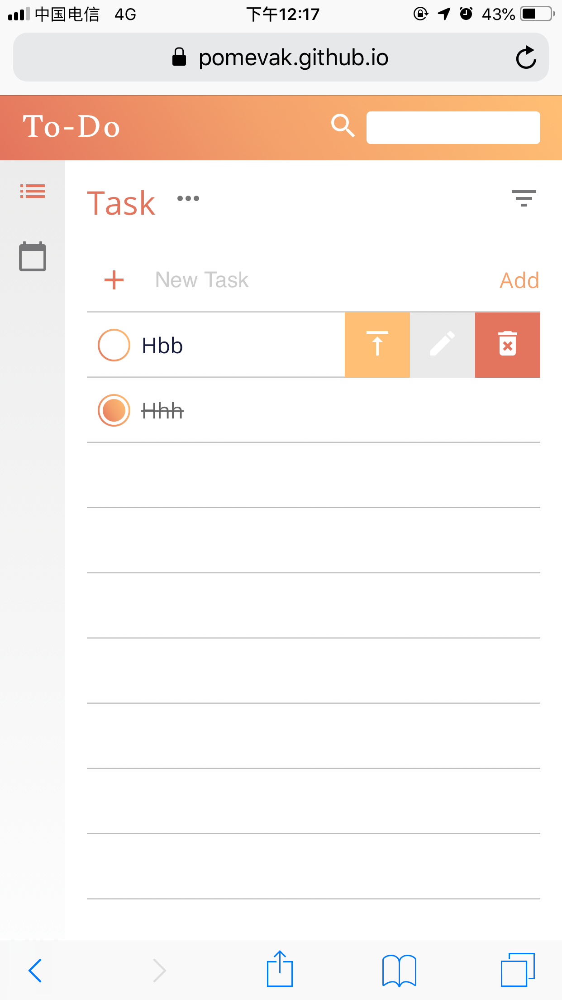
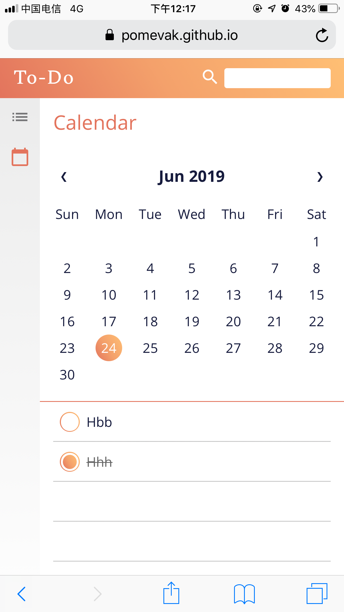
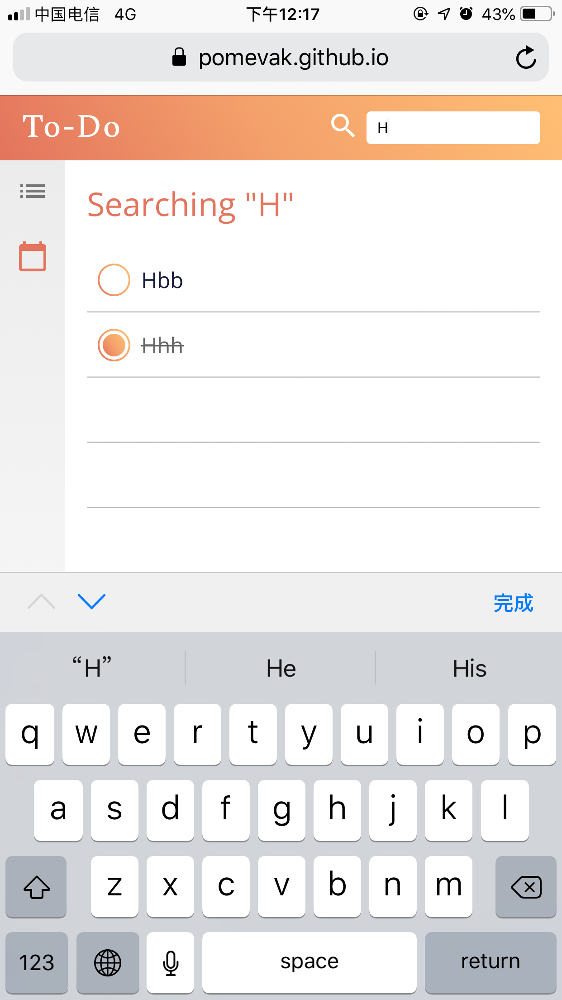
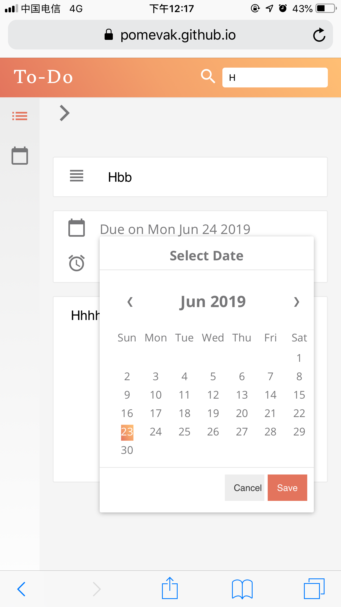

(目前只做了移动端适配）
### 基本功能：

- [x] 新增，删除，展示列表
- [x] 全部完成/取消，删除已完成
- [x] 保存页面状态，刷新页面后可恢复

### 高级功能

- [x] 过滤
- [x] 编辑单条Todo
- [x] 添加详情和截止日期信息，到期后自动完成
- [x] 搜索功能
- [x] 按截止日期查找Todo
- [x] 添加向左滑动的交互手势，向左滑动显示“置顶”，“编辑”和“删除”按钮
- [x] 单条Todo置顶

### 预览

